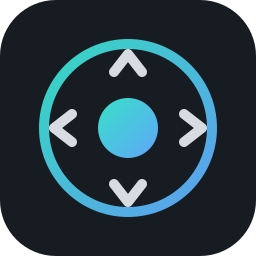

<p align="center">
  
</p>

<h1 align="center">SpaceMouse WASD</h1>

<p align="center">
  Spacemouse-style fly-through navigation for Autodesk Fusion —<br/>
  using nothing but your regular mouse and keyboard.
</p>

<p align="center">
  
  
  
  
</p>

---

Hold a side mouse button and Fusion turns into a video game: the mouse orbits
the model (cursor hidden, spacemouse-style), keys glide you around with
smooth, velocity-damped motion. Release the button and everything is
instantly back to normal.

## Controls (defaults — all rebindable in the app)

| Input | Action |
|---|---|
| **Hold forward side button** | Enter fly mode (or a key combo — see below) |
| **Mouse** | Orbit around the model |
| **W / S** | Pan up / down |
| **A / D** | Pan left / right |
| **Shift / Ctrl** | Zoom in / out (smooth dolly toward the model) |
| **Scroll wheel** | Adjust speed — or zoom, switchable in the app |
| **Esc** | Bail out of fly mode |

## How it works

Two parts talk over localhost UDP (port 42737):

```
┌─────────────────────────┐   motion packets    ┌─────────────────────────┐
│  Controller app (this   │ ──── UDP 42737 ───► │  Fusion add-in          │
│  repo's UI): low-level  │                     │  smooths velocities and │
│  input hooks capture    │ ◄─── heartbeat ──── │  drives the viewport    │
│  mouse + bound keys     │                     │  camera every frame     │
└─────────────────────────┘                     └─────────────────────────┘
```

The external controller is required because Fusion binds keys like `S` and
`D` to commands — a low-level hook intercepts your movement keys *only while
flying*, so they never trigger anything. The add-in applies exponential
velocity smoothing (the spacemouse "glide") and re-anchors the orbit/zoom
pivot onto the model itself, so zooming flies toward the geometry and
orbiting after a deep zoom rotates around what you're looking at.

On Windows the controller is pure Python standard library — no packages to
install. On macOS the controller is a **native Swift app** (in
`mac-controller/`) that talks the same UDP protocol: zero runtime
dependencies, no Python or Homebrew, and clean native permission prompts.
The Fusion add-in itself is Python on both platforms — Fusion's add-in API
requires it.

## Install — Windows

Requirements: Windows 10/11, [Python 3.9+](https://python.org) (check
"Add to PATH" when installing), Autodesk Fusion.

1. Download this repo (green **Code** button → Download ZIP) and unzip it
   somewhere permanent.
2. Run **`install_addin.bat`** — copies the add-in into Fusion's add-ins
   folder. Restart Fusion (the add-in runs on startup).
3. Run **`SpaceMouseWASD.bat`** — opens the controller app. When the status
   card shows **Connected**, hold the forward side mouse button in Fusion
   and fly.

Tick *Launch at Windows startup* in the app and you never have to think
about it again.

## Install — macOS

Requirements: macOS 12+, Autodesk Fusion. No Python, Homebrew, or Xcode —
the controller is a native app you download and open.

1. Download `SpaceMouseWASD-macos.zip` from the
   [Releases page](../../releases/latest), unzip, and drag
   **SpaceMouseWASD.app** to Applications (universal — Apple Silicon + Intel).
2. Download this repo (green **Code** button → Download ZIP) and run
   **`./install_addin.sh`** — copies the add-in into Fusion's add-ins folder.
   Restart Fusion (the add-in runs on startup).
3. Open the app. First launch is blocked as an "unidentified developer" —
   clear the download quarantine once with
   `xattr -dr com.apple.quarantine "/Applications/SpaceMouseWASD.app"`, then
   reopen. macOS prompts for **Accessibility** and **Input Monitoring**
   (System Settings → Privacy & Security); grant both and relaunch. When the
   status card shows **Connected**, hold the forward side mouse button in
   Fusion and fly.

Want a plain double-click with no Terminal step? Sign with an Apple Developer
ID and notarize — [`mac-controller/README.md`](mac-controller/README.md) covers
that and building from source.

On macOS the default zoom keys are Shift / Control, and "side buttons"
are mouse buttons 4 and 5 (most third-party mice; drivers that remap
them to gestures may need those remaps disabled).

> **Tip:** Fusion defaults to an orthographic camera, where zoom is just
> magnification. For the full fly-toward-it depth feel, click the dropdown
> next to the ViewCube and switch to **Perspective**.

## Configuring

Everything lives in the app: click any key button and press a new key to
rebind, pick which side button activates fly mode, and drag the speed
slider.

The **scroll wheel** during flight either adjusts speed (default) or zooms
like regular Fusion — pick in the Scroll wheel dropdown. (Wheel zoom needs
add-in v1.3.0+; re-run the installer if you're upgrading.) *Windows only for
now — the macOS app always uses the wheel for speed.*

The fly trigger can also be a **key combo** (e.g. Ctrl+Alt+L) instead of a
side button — pick *Key combo* in the Fly trigger dropdown and press your
combo. This is the right choice if your mouse software (Logitech Options+,
Razer Synapse, ...) remaps side buttons to keyboard shortcuts: those arrive
as synthetic keystrokes, which the combo trigger deliberately accepts.
*Windows only for now — the macOS app triggers on the side buttons.*
Settings persist per-platform to
`%APPDATA%\SpaceMouseWASD\config.json` on Windows and
`~/Library/Application Support/SpaceMouseWASD/config.json` on macOS.

Camera *feel* (sensitivity, glide floatiness, axis inversion) lives at the
top of `addin/SpaceMouseWASD/SpaceMouseWASD.py`:

| Constant | What it does |
|---|---|
| `ORBIT_SENS` | Orbit degrees per pixel of mouse movement |
| `PAN_SPEED` / `DOLLY_SPEED` | Pan / zoom rates |
| `TAU_MOVE` / `TAU_ORBIT` | Smoothing time constants — bigger = floatier |
| `INVERT_ORBIT_X/Y`, `INVERT_ZOOM` | Flip directions |

After editing, re-run `install_addin.bat` and restart the add-in
(Shift+S → Add-Ins → SpaceMouseWASD → Stop → Run).

## Troubleshooting

- **Add-in shows "Waiting..."** — Fusion isn't running the add-in. In
  Fusion: Shift+S → Add-Ins tab → SpaceMouseWASD → Run (tick *Run on
  Startup*). The add-in logs to Fusion's Text Commands palette.
- **Side button doesn't trigger fly mode** — some mouse drivers remap side
  buttons to keyboard shortcuts instead of real button events. Either set
  them back to default "Back"/"Forward" in your mouse software, or switch
  the Fly trigger to *Key combo* in the app and use the shortcut your mouse
  software sends.
- **Wrong orbit/zoom direction** — flip the `INVERT_*` flags in the add-in.
- **Orbit tilts the horizon / feels like free orbit** — fixed in add-in
  v1.3.2, which rebuilds the camera frame from the world up axis every frame
  so roll stays at zero; update the add-in. If the *axis* itself is wrong
  (orbit spins around the wrong direction), pin `ORBIT_UP_AXIS` to `'y'` or
  `'z'` in the add-in.
- **Nothing happens after granting permission on macOS** — TCC ties the
  grant to the exact signed app; rebuilding with `build_app.sh` ad-hoc-signs
  it, so if a rebuild's identity changes you may need to remove and re-add
  SpaceMouse WASD under Accessibility / Input Monitoring, then relaunch.
- **Fusion window not detected** — the controller matches the foreground
  window/app name against `Fusion`; if Autodesk renames it, update
  `WINDOW_MATCH` in `controller/backend_win.py` (Windows) or the `Fusion`
  match in `mac-controller/Sources/SpaceMouseWASD/Engine.swift` (macOS).

## Repo layout

```
addin/SpaceMouseWASD/           Fusion add-in (camera driver, cross-platform)
mac-controller/                 macOS controller — native Swift app (build_app.sh)
controller/spacemouse_wasd.py   Windows controller app (UI + config)
controller/engine_base.py       Shared engine core (state + UDP streaming)
controller/backend_win.py       Windows input backend (ctypes LL hooks)
controller/backend_mac.py       Legacy macOS input backend (Quartz, Python)
assets/                         Logo and icon
scripts/gen_icon.py             Regenerates assets/icon.png
SpaceMouseWASD.bat              Launch the controller app (Windows)
install_addin.bat / .sh         Install/update the Fusion add-in (Win / mac)
```

## Credits

macOS testing and fixes: Devansh Gaur — dragged-event capture, background
cursor hiding, and the cross-platform custom widgets.

Key-combo trigger for remapped mouse buttons: prompted by
[#1](../../issues/1) from TMTYD, including the diagnosis that injected
keystrokes from mouse drivers were being filtered out.

## License

[MIT](LICENSE)
